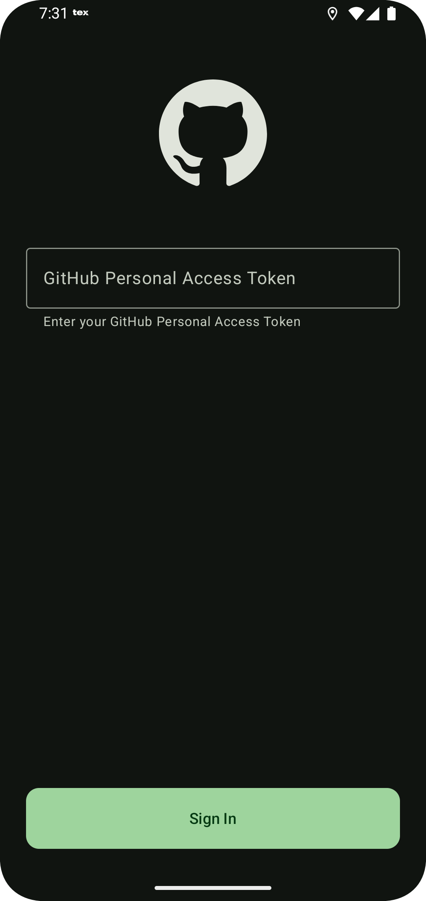
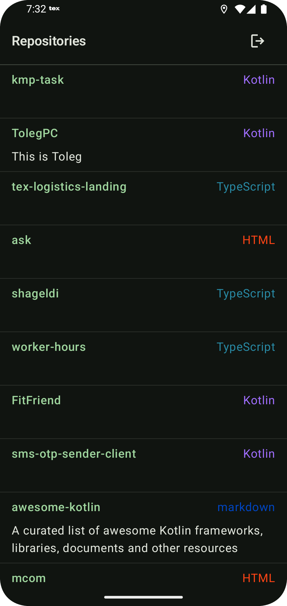
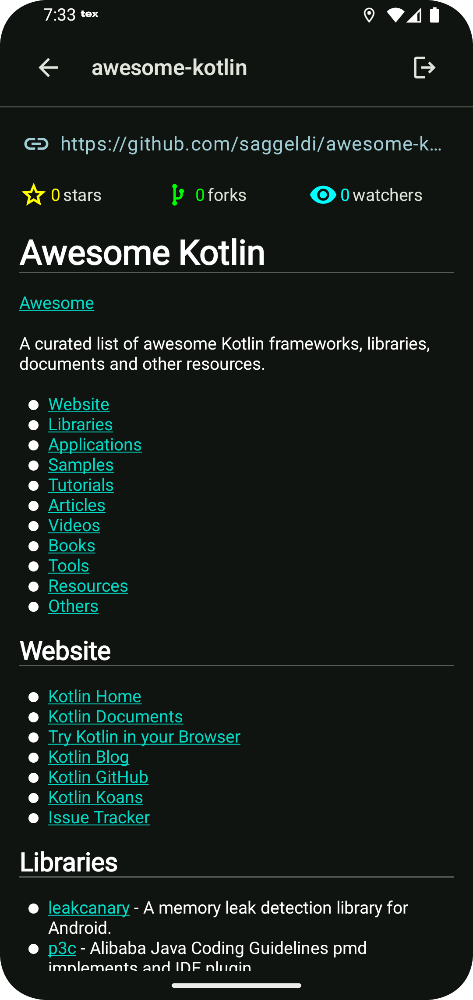
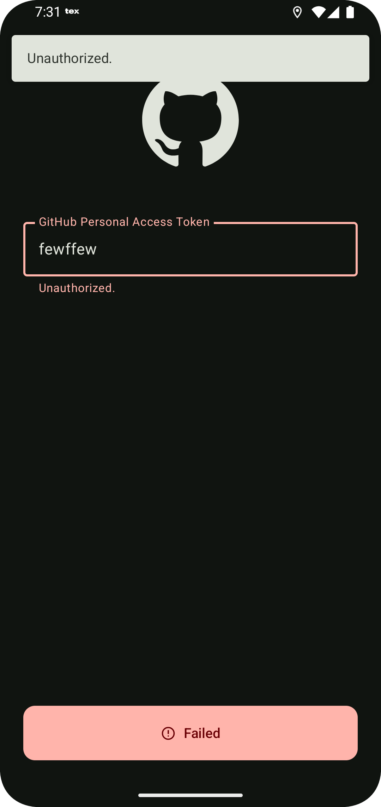
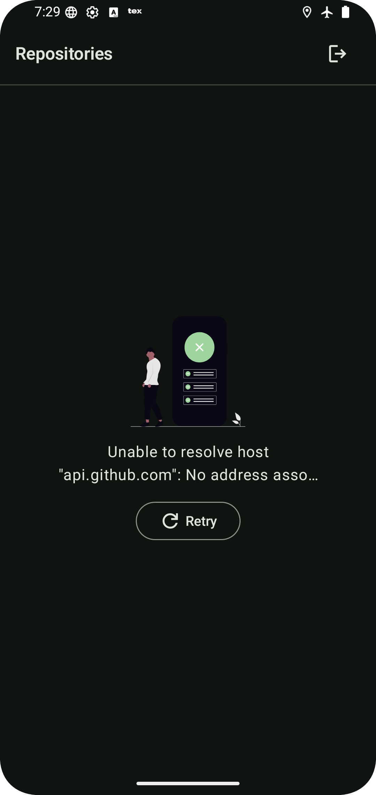

# 🐙 GitHubRepo KMP

<div align="center">
  

[](https://kotlinlang.org)
[](https://android-arsenal.com/api?level=21)
</div>

## 📖 Description

**GitHubRepo KMP** is a modern cross-platform mobile application built with Kotlin Multiplatform and Jetpack Compose. The app provides a seamless experience for browsing GitHub repositories, featuring user authentication via personal access tokens, repository exploration, and detailed repository information display.

🚀 **Key Features:**
- 🔐 Secure authentication using GitHub Personal Access Tokens
- 📱 Browse your first 10 repositories with elegant UI
- 🌐 User can select Russian or English from device settings using Per-app language preferences of android (Settings > Apps > (select a GHRepo app) > Language)
- 🔍 Detailed repository information including stats, license, and README
- 📊 Repository statistics (forks, stars, watchers)
- 🌐 Direct links to repository web pages
- 📄 Built-in README viewer with markdown support

🚀 **CI/CD with GitHub Actions**
- 🏗️ Automated build process description
- 📧 Email distribution setup for APK delivery
- 🔄 Workflow trigger conditions
- 🎯 Required GitHub secrets configuration

## 🛠️ Technologies Used

### Core Technologies
- **🎯 Kotlin Multiplatform** - Code sharing across platforms
- **🎨 Jetpack Compose** - Modern declarative UI
- **📱 Android** - Native Android development

### Networking & Data
- **🌐 Ktor 3.2.3** - HTTP client for API communication
- **📡 Kotlin Serialization** - JSON parsing and serialization

### UI & Navigation
- **🧭 Navigation Compose 2.9.3** - Type-safe navigation
- **🖼️ Coil 3.3.0** - Async image loading
- **📝 Markwon 4.6.2** - Markdown rendering
- **🎨 Material 3** - Material Design components

### Architecture & DI
- **💉 Koin 4.1.0** - Dependency injection
- **🏗️ MVVM Architecture** - Clean architecture pattern
- **♻️ Lifecycle Components** - Android lifecycle awareness

### Development Tools
- **🔧 Android Gradle Plugin 8.12.0**
- **📋 Kotlin 2.2.0**
- **🎯 Target SDK 35** / **📱 Min SDK 21**

## 📱 Screenshots

<div align="center">
  
  
  
</div>

<div align="center">
  
  
</div>

### 🎥 Demo Video
[📹 Screen Recording Demo](https://raw.githubusercontent.com/saggeldi/kmp-task/refs/heads/master/assets/demo.mp4)

## 🏗️ Project Structure

```
GitHubRepo/
├── 📱 app/                     # Android application module
│   ├── src/androidMain/
│   │   ├── kotlin/            # Android-specific code
│   │   └── AndroidManifest.xml
│   └── build.gradle.kts
│
├── 🎨 core_ui/                 # UI components and theming
│   ├── src/main/
│   │   └── java/            # Shared UI components
│   └── build.gradle.kts
│
├── 🤝 shared/                  # Kotlin Multiplatform shared code
│   ├── src/
│   │   ├── commonMain/        # Platform-agnostic code
│   │   ├── androidMain/       # Android-specific implementations
│   │   └── iosMain/          # iOS-specific implementations (future)
│   └── build.gradle.kts
│
├── 📁 assets/                  # App screenshots and media
├── 📋 gradle/libs.versions.toml # Version catalog
└── 📖 README.md
```

## 🚀 Getting Started

### Prerequisites
- **Android Studio** Android Studio Narwhal Feature Drop | 2025.1.2
- **JDK 17** or higher
- **Android SDK** with API level 35
- **GitHub Personal Access Token** ([Create one here](https://github.com/settings/tokens))

### Installation

1. **Clone the repository**
   ```bash
   git clone https://github.com/saggeldi/kmp-task
   cd kmp-task
   ```

2. **Open in Android Studio**
  - Launch Android Studio
  - Select "Open an existing project"
  - Navigate to the cloned directory

3. **Create jks file and config files**
   - Upload your own jks file to app/keystore folder
   - Create keystore_config.cfg file with following content inside app/keystore folder
      ```
     storeFile = keystore/app.jks
     storePassword = test
     keyPassword = test
     keyAlias = upload
     ```
   - Create app.cfg file with following content inside shared/config folder
      ```
      GH_API_VERSION = 2022-11-28
     ```

3. **Build the project**
   ```bash
   ./gradlew build
   ```

4. **Run the app**

### 🔑 Authentication Setup

1. Generate a GitHub Personal Access Token:
  - Go to GitHub Settings → Developer settings → Personal access tokens
  - Generate a new token with `repo` scope
  - Copy the token

2. Launch the app and enter your token in the login screen

## ✨ Features Overview

### 🔐 Authentication
- Secure login using GitHub Personal Access Tokens
- Token validation and error handling
- Persistent session management

### 📚 Repository Browsing
- Display first 10 user repositories
- Beautiful card-based layout
- Repository thumbnails and basic info
- Pull-to-refresh functionality

### 📊 Repository Details
- **Statistics Display**: Stars ⭐, Forks 🍴, Watchers 👁️
- **Web Integration**: Direct links to GitHub repository pages
- **License Information**: Clear license display
- **README Viewer**: Full markdown rendering with syntax highlighting
- **Repository Metadata**: Creation date, last update, primary language


### Development Guidelines
- Follow Kotlin coding conventions
- Write meaningful commit messages
- Add tests for new features
- Update documentation as needed


## 🙏 Acknowledgments

- **GitHub API** for providing excellent repository data
- **JetBrains** for Kotlin Multiplatform
- **Google** for Android and Jetpack Compose
- **Community** for amazing open-source libraries

## 📞 Contact

- **GitHub**: [@saggeldi](https://github.com/saggeldi)
- **Email**: multiplatform00@gmail.com

---

<div align="center">
  Made with ❤️ using Kotlin Multiplatform & Jetpack Compose

⭐ **Star this repository if you found it helpful!** ⭐
</div>